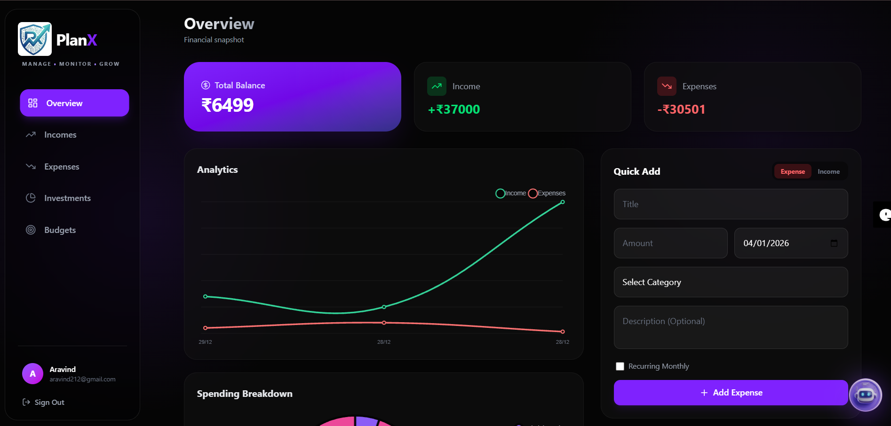
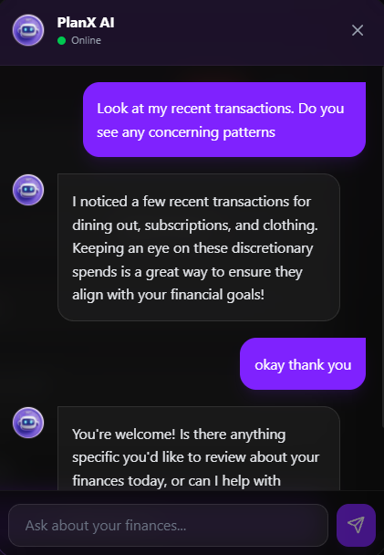
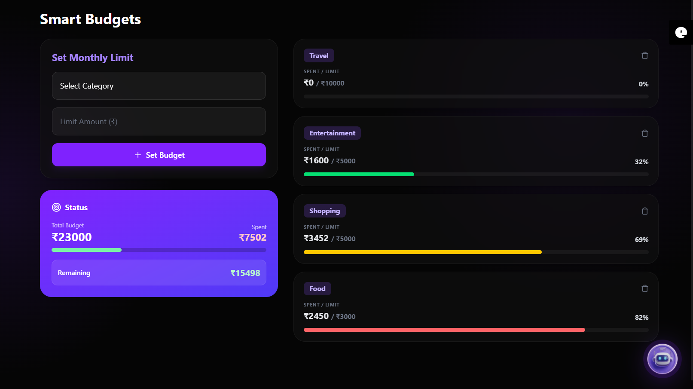
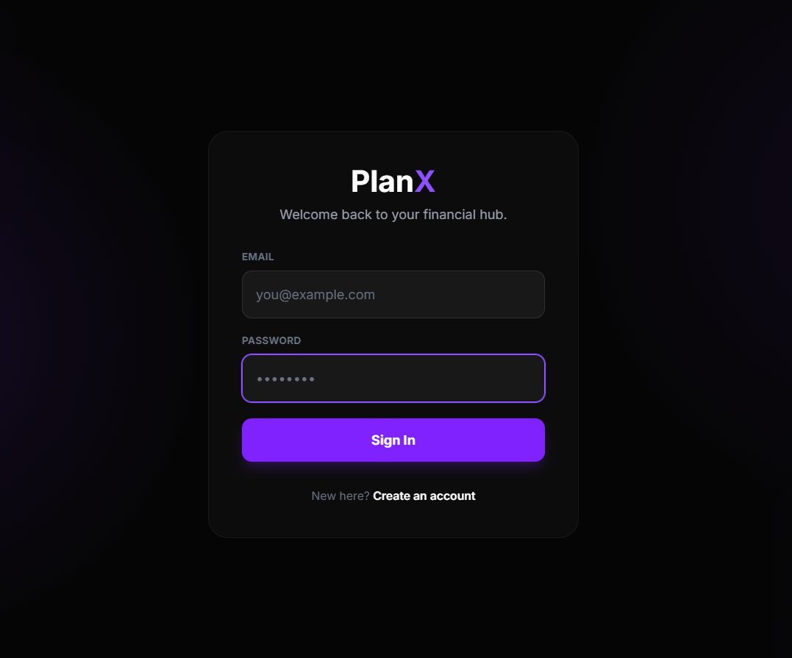
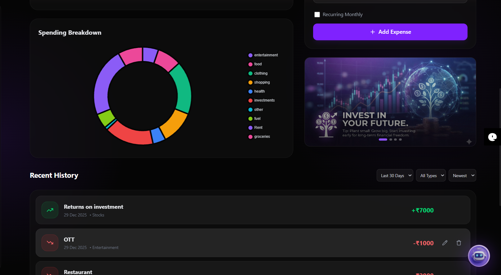

# PlanX – AI-Powered Personal Finance Platform

**PlanX** is a next-generation financial management application engineered to empower users with real-time tracking, intelligent data visualization, and personalized AI guidance. Built on the **MERN Stack**, it features a high-performance **Responsive UI** and integrates **Google's Gemini API** to provide context-aware financial advice.

---

## Features

### Generative AI Integration

- **Context-Aware Assistant:** A smart chatbot powered by **Google Gemini API** that analyzes user data in real-time.
- **Dynamic Prompt Injection:** Automatically feeds live financial context (balance, savings rate, recent transactions) into the LLM prompt to generate hyper-personalized budgeting advice.
- **RAG-Lite Architecture:** Retrieves relevant financial history to ground AI responses in factual user data.

### 🔐 Security & Core Functionality

- **Robust Authentication:** Secure JWT-based login and registration system with protected API routes.
- **Comprehensive Financial Tracking:** CRUD operations for Incomes, Expenses, and Investment portfolios.
- **Smart Budgeting:** Set category-based monthly limits with visual progress bars and over-budget alerts.

### Premium User Experience (UI/UX)

- **Dark Glass Aesthetic:** A modern, tactile interface utilizing advanced **Glassmorphism** effects, backdrop blurs, and vibrant gradients.
- **Mobile-First Design:** Fully responsive layout featuring an adaptive **Sidebar Dock** that transforms into a gesture-friendly mobile menu.
- **Interactive Visualizations:** High-performance **Line and Doughnut charts** (via Chart.js) for instant spending breakdowns and income trends.

---

## Technology Stack

| Component     | Technology                | Description                                |
| :------------ | :------------------------ | :----------------------------------------- |
| **Frontend**  | **React.js**              | Component-based UI architecture            |
| **Styling**   | **Tailwind CSS**          | Utility-first CSS for "Dark Glass" theming |
| **Backend**   | **Node.js & Express**     | Scalable RESTful API development           |
| **Database**  | **MongoDB**               | NoSQL database for flexible data storage   |
| **AI Engine** | **Google Gemini API**     | LLM for conversational financial insights  |
| **Charts**    | **Chart.js**              | Data visualization library                 |
| **Auth**      | **JWT (JSON Web Tokens)** | Stateless session management               |

---

## Installation & Setup

Follow these steps to set up the project locally.

### Prerequisites

- Node.js (v14+)
- MongoDB (Local or Atlas)
- Google Gemini API Key

### 1. Clone the Repository

```bash
git clone https://github.com/Aravind633/PlanX.git
cd PlanX
```

### 2. Backend Setup

Navigate to the server directory and install dependencies.

```bash
cd server
npm install
```

Create a .env file in the server directory:

```bash
PORT=5000
MONGO_URL=your_mongodb_connection_string
JWT_SECRET=your_super_secret_key
GEMINI_API_KEY=your_google_gemini_api_key
```

Start the server:

```bash
npm run dev
```

### 3. Frontend Setup

Open a new terminal, navigate to the client directory, and install dependencies.

```bash
cd client
npm install
```

Start the React development server:

```
npm run dev
```

Your application should now be running at http://localhost:3000.

---

### AI Implementation Detail

PlanX moves beyond generic chatbots by implementing Context Injection.

**Data Aggregation:** The system calculates real-time metrics (Total Balance, Top Expense Category, Savings Rate) on the client side.

**Prompt Engineering:** These metrics are dynamically inserted into a structured system prompt before being sent to the Gemini API.

## **Response Generation:** The AI responds specifically to the user's financial situation (e.g., "You've spent 40% of your income on Food this month, try to...") rather than giving generic advice.

## Application Screenshots

### 📊 Dashboard & Analytics

<div align="center">
  
</div>
<br/>

### 📱 Features & Interface

<div align="center">
  
  &nbsp; &nbsp; 
  
  <br/><br/> 
  &nbsp; &nbsp; 
</div>

---
